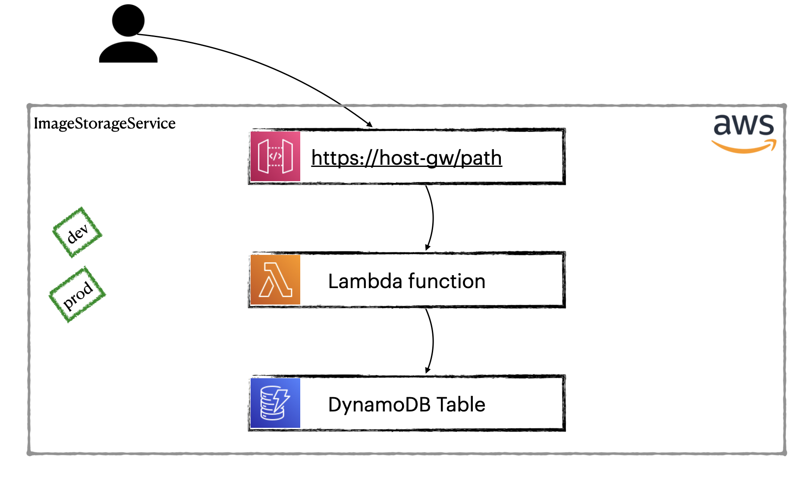

# AWS Staging Demo
_Author: Nikita Kozlov_\
_Date: Jan.2022_

This project shows how to organize development in AWS Cloud with staging. We would be using different AWS accounts to organize staging. 
It is the most efficiently way for development in Cloud.

We build simple application that is based on Lambda. Additionally it integrates with API Gateway and DynamoDB.



## Structure

This project was created by Serverless Framework using command `serverless create --template aws-nodejs --path aws-staging-demo` and then configure.

| Component        | Description                                                             |
|------------------|-------------------------------------------------------------------------|
| `_dev/`          | Used for local testing only                                             |
| `infra/`         | Consists of _AWS Cloud Formation_ templates                             |
| `presentation/`  | Consists of presentation's files                                        |
| `staging/`       | Configuration files are located here for different stages               |
| `*.ts`           | TypeScript code of lambda function                                      |
| `serverless.yml` | Configuration of serverless application (using by Serverless Framework) |
| _other files_    | Rest of files are standard for nodejs projects                          |

## Software requirements

- NodeJS (version 14+)
- npm
- Serverless Framework ([how to install](https://www.serverless.com/framework/docs/getting-started#installation))
- aws-cli ([official doc](https://docs.aws.amazon.com/cli/latest/userguide/getting-started-install.html) or 
install via [brew](https://formulae.brew.sh/formula/awscli))

## Tutorial

### 1. Create two AWS Accounts
Go to [AWS website](https://aws.amazon.com/ru/) and create two independent accounts (require two different emails).
One of them will be using for _dev_ stage, another will be _prod_.

### 2. Create AWS users

Serverless Framework requires special user for working. So, let's create them for our _dev_ and _prod_ accounts.
We create users with same name for both accounts, it is called `serverless-admin`. You can choose your own name, but it is recommended name.

1. Log in to _dev_ account
2. Create user `serverless-admin` in _dev_ account using [documentation](https://www.serverless.com/framework/docs/providers/aws/guide/credentials#creating-aws-access-keys)
3. Repeat steps 1 and 2 for _prod_. 
4. Save API Key & Secret to a temporary place for both users.

### 3. Configure aws-cli

We need to configure aws-cli for _dev_ and _prod_ account working with.

1. Open Terminal
2. Create profile for _dev_ `aws configure --profile dev-sls-admin-us-east-2`
   1. API Key & Secret using for _dev_ `serverless-admin` (we are saved it above)
   2. Default region name is _us-east-2_
   3. Default output format is _json_
3. Create profile for _prod_ `aws configure --profile prod-sls-admin-us-east-2`
   1. API Key & Secret using for _prod_ `serverless-admin` (we are saved it above)
   2. Default region name is _us-east-2_
   3. Default output format is _json_
 
See [AWS CLI docs](https://docs.aws.amazon.com/cli/latest/userguide/cli-configure-quickstart.html#cli-configure-quickstart-profiles)

### 4. Configure project

AWS Lambda is following way when you build your code locally with all necessary dependencies. 
Then you deploy archive to Lambda (via S3 for example). Let's install npm dependencies and 
configure serverless plugin `serverless-plugin-typescript`. We need the plugin because we are using TypeScript.

1. Open Terminal and go to project folder
2. Install npm dependencies `npm install`
3. Install Serverless plugin `serverless plugin install --name serverless-plugin-typescript`

### 5. Work with Lambda locally

As we have not run DynamoDB locally, we should create DynamoDB on _dev_ firstly. 
Then we can run Lambda locally and test it.

1. Open Terminal
2. Set AWS_PROFILE `export AWS_PROFILE=dev-sls-admin-us-east-2`\
It is necessary for correct working aws-cli with our _dev_.
3. Create DynamoDB table using template `infra/Create-DynamoDB-table.yaml`
```
aws cloudformation deploy \
--template-file infra/Create-DynamoDB-table.yaml \
--stack-name dynamoDB-image-storage-service-stack-dev \
--tags cf/stack.name=dynamoDB-image-storage-service-stack-dev \
--parameter-overrides Stage=dev StackName=dynamoDB-image-storage-service-stack-dev \
--region us-east-2
```
Check your AWS _dev_ account, you find resources that have been created. It is CloudFormation stack `dynamoDB-image-storage-service-stack-dev` 
and DynamoDB table `ImageDescription-dev`.

4. Run lambda locally
   1. Create record in DynamoDB table `sls invoke local -f imageStorageService --path _dev/http-gw-post-with-params.json`
   2. Get created record `sls invoke local -f imageStorageService --path _dev/http-gw-get-with-params.json`
   3. Get all records `sls invoke local -f imageStorageService --path _dev/http-gw-get-no-params.json`
5. For debugging in Intellij IDEA
   1. Find Actions -> Registry -> `js.debugger.use.node.options` set to _false_
   2. Add Run Configuration
      * Add New Configuration _Node.js_
      * JavaScript file: _/usr/local/lib/node_modules/serverless/bin/serverless.js_
      * Application parameters: _invoke local -f imageStorageService --path \_dev/http-gw-get-with-params.json_
      * Environment variables: _AWS_PROFILE=dev-sls-admin-us-east-2_
   3. Run your configuration, then set breakpoints in file `.build/handler.js` and then run in debug mode.

### 6. Deploy Lambda to _dev_

We are ready to deploy our lambda to AWS (_dev_).
1. Open Terminal
2. Set AWS_PROFILE `export AWS_PROFILE=dev-sls-admin-us-east-2`
3. Deploy lambda `sls deploy`
4. In Terminal we can see endpoint, click on it!
5. You can use `_dev/rest-client/client-dev.rest` for testing your lambda on _dev_.

### 7. Prepare to deploy to _prod_

When we want to migrate our lambda to _prod_ we doesn't want to build and package our code again. 
We want to use artifact that was tested. In our tutorial we don't use separate s3 bucket for our artifacts, 
but it needs ideally. We will use bucket that was created by Serverless Framework on our _dev_.

1. Make our *.zip into S3 accessible for _prod_ account (sure that you execute command by `AWS_PROFILE=dev-sls-admin-us-east-2`)
```
aws cloudformation deploy \
--template-file infra/ServerlessDeploymentBucket-Policy.yaml \
--stack-name serverless-deployment-bucket-policy \
--tags cf/stack.name=serverless-deployment-bucket-policy \
--region us-east-2
```
2. Let's go to AWS Console (_dev_), open S3 Service and find _ServerlessDeploymentBucket_\
In my case bucket is called _image-storage-service-de-serverlessdeploymentbuck-2yxlci5u0dg6_
3. Open it and find inside `image-storage-service.zip` file
4. Click on it and copy S3 URI
5. Open file `staging/prod/serverless.yml` and replace value in `functions.imageStorageService.package.artifact` with copied
6. We are ready to deploy our app to _prod_!

### 8. Deploy to _prod_

1. In Terminal set `export AWS_PROFILE=prod-sls-admin-us-east-2`
2. Create DynamoDB table in _prod_
```
aws cloudformation deploy \
--template-file infra/Create-DynamoDB-table.yaml \
--stack-name dynamoDB-image-storage-service-stack-prod \
--tags cf/stack.name=dynamoDB-image-storage-service-stack-prod \
--parameter-overrides Stage=prod StackName=dynamoDB-image-storage-service-stack-prod \
--region us-east-2
```
3. Deploy serverless app to _prod_ using `staging/prod/serverless.yml`\
Execute command `cd staging/prod && sls deploy`
4. For testing use `_dev/rest-client/client-dev.rest` with 'prod' environment (set it before).

## That's all :)
Thank you!\
See you soon.